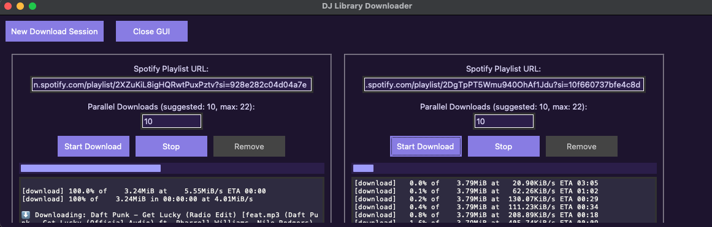

# DJ Library Downloader

A parallelized Spotify playlist downloader built for DJs. Provide a public Spotify playlist URL and the tool will locate each track on YouTube, download it, convert it to `.mp3`, and tag it with full metadata — artist, title, album, year, and genre — in a format compatible with Serato, Traktor, and other DJ software.

---


*Multiple download sessions running in parallel via the GUI.*

---

## Features

- Paste any public Spotify playlist link and download all tracks automatically
- Parallel download sessions (up to 6 simultaneous) with live progress and console output
- MP3 files tagged with Serato/Traktor-compatible ID3 metadata
- Tracks organized by playlist into a clean folder structure
- Bonus scripts for organizing your library into Serato crates by decade or BPM

---

## Prerequisites

Before setting up the project, ensure the following are installed on your system:

- **Python 3.8+** — [python.org](https://www.python.org/downloads/)
- **FFmpeg** — required by `yt-dlp` to convert audio

### Installing FFmpeg

**macOS:**

If you don't have Homebrew installed:
```bash
/bin/bash -c "$(curl -fsSL https://raw.githubusercontent.com/Homebrew/install/HEAD/install.sh)"
```

Then install FFmpeg:
```bash
brew install ffmpeg
```

**Windows:**

FFmpeg binaries are bundled in the repo under `ffmpeg/bin/`. Add that folder to your system PATH:

1. Open **System Properties** → **Environment Variables**
2. Under **System Variables**, select `Path` and click **Edit**
3. Add the full path to `ffmpeg\bin\` inside your cloned repo (e.g., `C:\Users\you\dj-library\ffmpeg\bin`)

Alternatively, download the latest FFmpeg from [ffmpeg.org/download.html](https://ffmpeg.org/download.html) and add it to PATH manually.

**Linux:**
```bash
sudo apt update && sudo apt install ffmpeg
```

---

## Setup

### 1. Clone the Repository

```bash
git clone https://github.com/hunterbaisden/dj-library.git
cd dj-library
```

### 2. Create and Activate a Virtual Environment

```bash
python3 -m venv .venv
source .venv/bin/activate      # macOS / Linux
# .venv\Scripts\activate       # Windows
```

### 3. Install Python Dependencies

```bash
pip install -r requirements.txt
```

### 4. Configure Spotify API Credentials

This tool uses the Spotify Web API to fetch playlist and track metadata.

1. Go to the [Spotify Developer Dashboard](https://developer.spotify.com/dashboard/) and log in
2. Click **Create App** and fill in a name and description
3. Copy your **Client ID** and **Client Secret**
4. Copy the example credentials file:

```bash
cp keys.env.example keys.env
```

5. Open `keys.env` and replace the placeholder values with your credentials:

```
SPOTIPY_CLIENT_ID='your_client_id_here'
SPOTIPY_CLIENT_SECRET='your_client_secret_here'
```

> `keys.env` is loaded at runtime — do not rename it.

---

## Running the Application

From the project root (with your virtual environment active):

```bash
python dj_gui.py
```

The GUI lets you:

- Paste a Spotify playlist URL into a session
- Set the number of parallel download threads
- Monitor live download logs and a progress bar per session
- Add or remove sessions (removal is blocked while a download is active)
- Run up to 6 sessions simultaneously

---

## Output Structure

Downloaded tracks are saved under `Downloaded_Music/`:

```
Downloaded_Music/
└── <Playlist Name>/
    ├── Artist - Title.mp3
    ├── ...
    └── tracklist.csv
```

Each MP3 includes ID3 tags for `artist`, `title`, `album`, `year`, and `genre`.

---

## Bonus Tools

### MP3 Tag Viewer

`mp3_tag_viewer.py` — inspect the ID3 tags on any MP3 file.

Open the script and update the hardcoded path at the top to point to the file you want to inspect:

```python
file_path = 'Downloaded_Music/Your Playlist/Artist - Title.mp3'
```

Then run:

```bash
python mp3_tag_viewer.py
```

---

### Decade Crate Maker

`decade_crate_maker.py` — organizes your downloaded tracks into Serato-compatible crates grouped by year or decade.

When run, the script prompts you to:
1. Choose a main crate name (e.g., `Hip-Hop`)
2. Select one or more playlists from `Downloaded_Music/`
3. Choose grouping by **year** or **decade**

Crate files are written to Serato's `_Serato_/Subcrates` folder. An empty parent crate is created automatically.

> **Note:** Serato does not support nested crates natively via file structure. All crates are created at the root level — you will need to manually arrange subcrates within Serato after generation.

---

### BPM Crate Maker

`bpm_crate_maker.py` — sorts tracks from selected playlists into Serato-compatible crates grouped by BPM range.

When run, the script prompts you to:
1. Enter a crate name
2. Choose a BPM grouping increment (10 or 20 BPM)

Tracks without BPM metadata are placed in a `No BPM` crate.

> **Note:** Same nested crate limitation as above — all crates are written to the root level in Serato.

---

## Limitations

- Requires an active internet connection for Spotify metadata lookups and YouTube downloads
- Only works with **public** Spotify playlists
- Match quality depends on YouTube search accuracy — results may occasionally differ from the Spotify version
- `tkinter` is required for the GUI and is included with most standard Python installations

---

## License

This project is intended for personal, non-commercial use. Please be mindful of Spotify's and YouTube's terms of service when using this tool.
