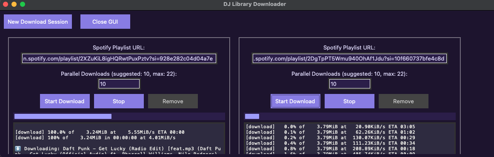

# DJ Library Downloader

A personal tool for building a DJ practice library from Spotify. Give it a Spotify playlist, album or track link and it finds the official studio audio on YouTube Music, then saves it as a 320 kbps MP3 with matched loudness and full ID3 metadata. Serato, Traktor, rekordbox and CDJs can read the files directly.



---

## Features

- **Clean audio sources.** Tracks are matched to the label's official Art Tracks on YouTube Music: studio audio with no music-video intros, skits or sound effects. Every match must agree with Spotify on title, artist and duration (within a few seconds). If no Art Track exists, the tool falls back to Topic-channel uploads, official audio and lyric videos, and music videos rank last.
- **Matched loudness without extra quality loss.** Each track is measured (EBU R128) and set to a common target, −14 LUFS by default, in the same encode that produces the MP3. The adjustment is a plain volume change: no compression, no limiting, and peaks are capped at −1 dBTP, so it can't introduce clipping.
- **Full metadata.** Title, all artists, album, album artist, full release date, track and disc number, genre, record label, ISRC, copyright, explicit/clean flag, lyrics, high-resolution cover art, plus links back to the Spotify and YouTube sources.
- **Fast parallel downloads.** Several tracks download at once, and Spotify metadata is fetched in batches. Tracks already in your library are skipped before any network calls, so re-running a playlist only picks up new additions. You can also choose to redownload existing files (see [Redownloading existing files](#redownloading-existing-files)).
- **Safe to stop.** Files are written atomically, so stopping a download never leaves a half-written MP3 that looks complete.
- **Multi-session GUI.** Run up to six downloads side by side, each with its own progress, ETA and color-coded log.

---

## Requirements

| Tool | Purpose | Install |
|------|---------|---------|
| [uv](https://docs.astral.sh/uv/) | Python and dependency management | `brew install uv` or see the [uv docs](https://docs.astral.sh/uv/getting-started/installation/) |
| [FFmpeg](https://ffmpeg.org/) | Audio decoding, loudness analysis, MP3 encoding | `brew install ffmpeg` (macOS) · `sudo apt install ffmpeg` (Linux) |
| Spotify API credentials | Playlist and track metadata | See [Configuration](#configuration) |

uv installs a suitable Python version automatically if you don't have one.

**Windows:** FFmpeg binaries can be placed in `ffmpeg/bin/` inside the project, and the tool will find them automatically. You can also install FFmpeg system-wide and add it to `PATH`.

---

## Setup

```bash
git clone https://github.com/hunterbaisden/dj-library.git
cd dj-library
uv sync
```

`uv sync` creates `.venv/` and installs the exact versions pinned in `uv.lock`.

### Configuration

1. Open the [Spotify Developer Dashboard](https://developer.spotify.com/dashboard/) and create an app.
2. Copy its **Client ID** and **Client Secret**.
3. Create your credentials file:

   ```bash
   cp keys.env.example keys.env
   ```

4. Fill in `keys.env`:

   ```
   SPOTIPY_CLIENT_ID='your_client_id_here'
   SPOTIPY_CLIENT_SECRET='your_client_secret_here'
   ```

`keys.env` is git-ignored and loaded from the project root.

---

## Usage

### GUI

```bash
uv run dj_gui.py
```

Paste one or more Spotify links into a session (separate multiple links with spaces to download them one after another) and press **Start** or Enter. Each session has these options:

| Option | Default | Description |
|--------|---------|-------------|
| Parallel downloads | 2 × CPU cores, max 8 | Number of tracks processed at once |
| Normalize to … LUFS | On, −14 | Target loudness. Turn it off to keep the original levels |
| Embed lyrics | On | Fetches plain-text lyrics from [LRCLIB](https://lrclib.net) |
| Files already in library | Skip | *Skip*, *Upgrade old downloads* or *Redownload everything* (see below) |

**Open Folder** opens that session's output folder, and **Open Library** opens `Downloaded_Music/`.

### Command line

```bash
uv run parallel_downloader.py "https://open.spotify.com/playlist/..."
```

| Flag | Description |
|------|-------------|
| `-t, --threads N` | Parallel downloads |
| `--target-lufs X` | Loudness target (default −14) |
| `--no-normalize` | Keep original loudness |
| `--no-lyrics` | Skip lyrics |
| `--existing MODE` | `skip` (default), `upgrade` or `overwrite` (see below) |
| `-o, --output DIR` | Output folder (default `Downloaded_Music/`) |

You can pass several links in one command. If you pass none, the script prompts for one.

---

## Output

```
Downloaded_Music/
├── <Playlist Name>/
│   ├── <Artist> - <Title>.mp3
│   └── tracklist.csv
├── <Artist> - <Album>/        # album links
└── Singles/                   # single-track links
```

`tracklist.csv` lists every track with its status (`downloaded`, `not found`, `failed`, `duplicate`), the source it was taken from, its YouTube URL, its original loudness and the gain that was applied. Use it to spot tracks that need attention.

### Audio format

320 kbps CBR MP3 with ID3v2.3 tags, the most widely compatible combination for DJ software and hardware.

### Embedded tags

| Frame | Content |
|-------|---------|
| `TIT2` / `TPE1` / `TPE2` | Title, all artists, album artist |
| `TALB` / `TDRC` | Album, release date |
| `TRCK` / `TPOS` | Track number (`n/total`), disc number |
| `TCON` | Genre (from the artists' Spotify genres) |
| `TPUB` / `TCOP` / `TSRC` | Record label, copyright, ISRC |
| `COMM` / `TXXX:ITUNESADVISORY` | `Explicit` or `Clean` |
| `USLT` | Lyrics |
| `APIC` | Front cover (highest resolution available) |
| `WOAF` / `WOAS` | Spotify track URL, YouTube source URL |
| `TXXX:LOUDNESS_*` | Original loudness and gain applied |

Spotify no longer gives new API apps access to BPM or musical key. Let your DJ software analyze those.

---

## Utilities

### Crate makers (Serato)

```bash
uv run decade_crate_maker.py   # crates by year or decade
uv run bpm_crate_maker.py      # crates by BPM range (requires BPM tags, e.g. after Serato analysis)
```

Both prompt you for a crate name and the playlists to include, then write crates to `~/Music/_Serato_/Subcrates`. Serato doesn't support nested crates through the file structure, so all crates are created at the root level. Arrange them in Serato afterwards.

### Tag viewer

```bash
uv run mp3_tag_viewer.py "Downloaded_Music/<Playlist>/<Artist - Title>.mp3"
```

---

## Redownloading existing files

By default, files that are already in the library are left alone. To replace them, choose a different mode in the GUI's **Files already in library** setting or pass `--existing` on the command line:

| Mode | Redownloads |
|------|-------------|
| `skip` | Nothing. Only new tracks are downloaded |
| `upgrade` | Files made by the old version of this tool, identified by a missing `TXXX:SPOTIFY_TRACK_ID` tag. Running it again does nothing, because the files are already upgraded |
| `overwrite` | Every track in the link |

How replacement works:

- **Same file name and path.** The new file takes the place of the old one, so Serato crates and playlists keep pointing to it.
- **Old file kept on failure.** The old file is replaced only after the new one has finished downloading and been tagged. If a track can't be matched or the download fails, the existing file stays as it is.
- **Serato data is lost.** Serato saves cue points, loops, beatgrids and waveform overviews inside the MP3, and the new file doesn't have them. Re-analyze the replaced files in Serato. Copying cue points over wouldn't help, because the new audio usually starts at a different point (old downloads often had music-video intros), so the cues would land in the wrong places.

---

## Maintenance

YouTube changes often, and an outdated `yt-dlp` is the most common cause of `HTTP Error 403` download failures. To update it:

```bash
uv lock --upgrade-package yt-dlp && uv sync
```

---

## Limitations

- Works only with public Spotify playlists. Spotify-curated editorial playlists may not be available to new API apps.
- Tracks with no official upload, such as obscure covers or regional exclusives, are reported as *not found* instead of being replaced with a guess.
- Requires an internet connection for Spotify, YouTube and lyrics lookups.

---

## License

For personal, non-commercial use only. Respect the terms of service of Spotify, YouTube and the rights holders of the music you download.
